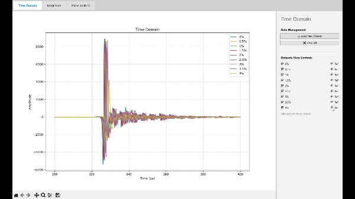

# 📉THz-TDS Toolkit🛠️

A lightweight GUI toolkit for viewing, processing and extracting data from terahertz time-domain spectroscopy (THz‑TDS) measurements.

## Features

- Load one or more datasets (currently limited to csv files with a simple time/real/imag layout).
- Time-domain view (raw waveform)
-   Frequency-domain analysis via FFT [1]
    - Magnitude view
    - Phase unwrapping [2] 
- Signal windowing [2], [3]

## Requirements

- Python 3.9+ (recommended)
- Dependencies:
  - tkinter
  - numpy
  - pandas
  - scipy
  - matplotlib

## Sources

[1] J. Neu and C. A. Schmuttenmaer, “Tutorial: An introduction to terahertz time domain spectroscopy (THz-TDS),” Journal of Applied Physics, vol. 124, no. 23, p. 231101, Dec. 2018, doi: [10.1063/1.5047659](https://doi.org/10.1063/1.5047659).

[2] W. Withayachumnankul and M. Naftaly, “Fundamentals of Measurement in Terahertz Time-Domain Spectroscopy,” J Infrared Milli Terahz Waves, vol. 35, no. 8, pp. 610–637, Aug. 2014, doi: [10.1007/s10762-013-0042-z](https://doi.org/10.1007/s10762-013-0042-z).

[3] J. Vázquez-Cabo, P. Chamorro-Posada, F. J. Fraile-Peláez, Ó. Rubiños-López, J. M. López-Santos, and P. Martín-Ramos, “Windowing of THz time-domain spectroscopy signals: A study based on lactose,” Optics Communications, vol. 366, pp. 386–396, May 2016, doi: [10.1016/j.optcom.2015.12.069](https://doi.org/10.1016/j.optcom.2015.12.069).

