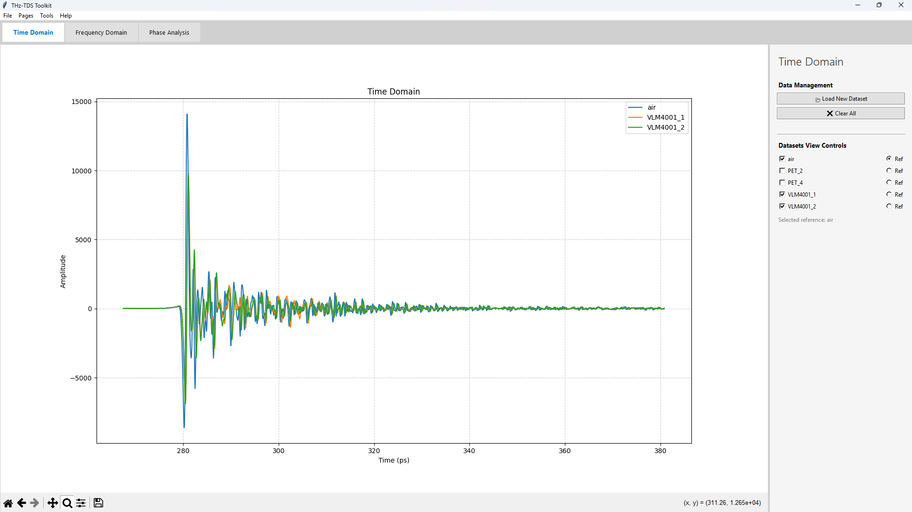
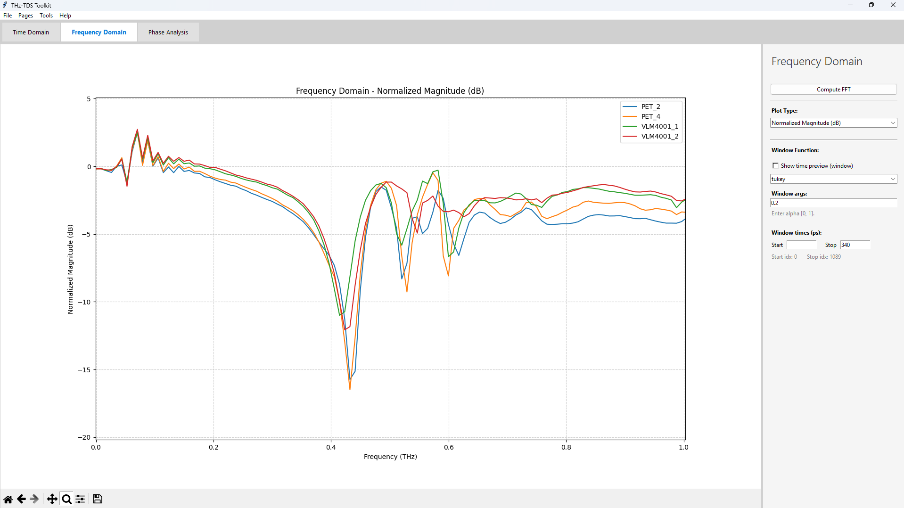
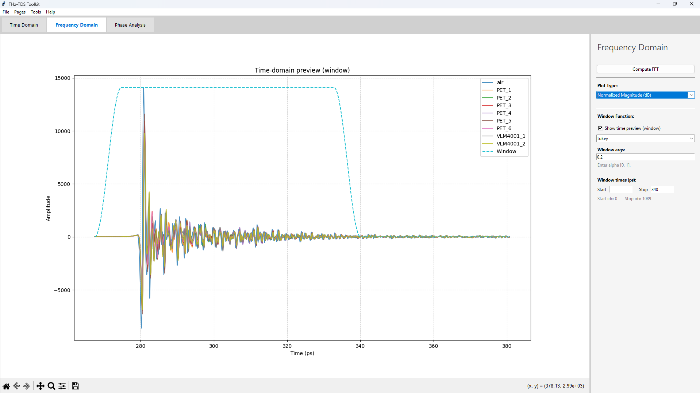
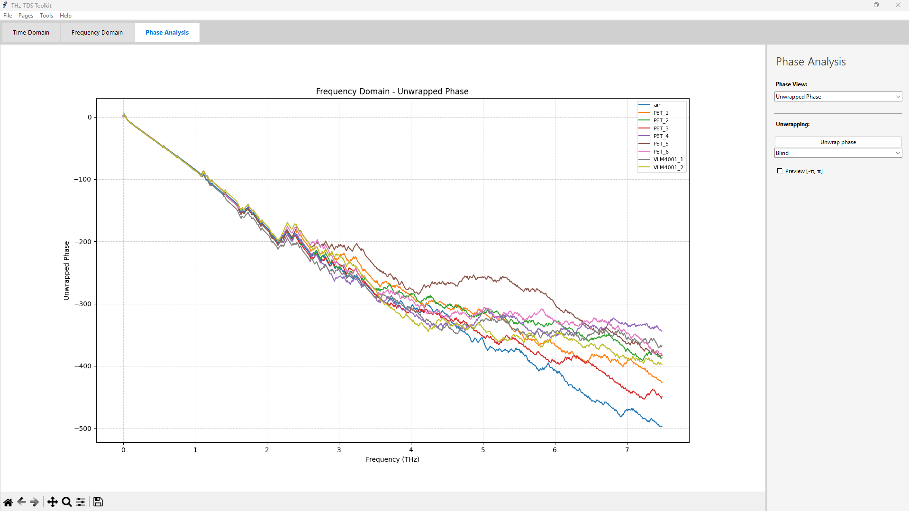

# 📉THz-TDS Toolkit🛠️

A lightweight GUI toolkit for viewing, processing and extracting data from terahertz time-domain spectroscopy (THz‑TDS) measurements.

## Features
### Time Domain

- Load one or more datasets 
- Preview raw time domain waveforms
- Select a reference signal for normalization
### Frequency Domain

- Compute Fourier transform [1]
- Select plot type to display
  - Magnitude
  - Magnitude (dB)
  - Normalized Magnitude
  - Normalized Magnitude (dB)
- Signal windowing [2] [3]
  - Preview window over time-domain signal
  - Select window type
  - Choose start and stop indices
  - Control window arguments
### Phase Analysis

- Select plot type to display
  - Phase
  - Unwrapped phase
- Compute Unwrapping [2]
- Select unwrapping method
  - Blind 
  - Informed [4]
- Preview datapoints for all signal in the [-π, π] range

## Requirements

- Python 3.9+ (recommended)
- Dependencies:
  - tkinter
  - numpy
  - pandas
  - scipy
  - matplotlib

## Sources

[1] J. Neu and C. A. Schmuttenmaer, “Tutorial: An introduction to terahertz time domain spectroscopy (THz-TDS),” Journal of Applied Physics, vol. 124, no. 23, p. 231101, Dec. 2018, doi: [10.1063/1.5047659](https://doi.org/10.1063/1.5047659).

[2] W. Withayachumnankul and M. Naftaly, “Fundamentals of Measurement in Terahertz Time-Domain Spectroscopy,” J Infrared Milli Terahz Waves, vol. 35, no. 8, pp. 610–637, Aug. 2014, doi: [10.1007/s10762-013-0042-z](https://doi.org/10.1007/s10762-013-0042-z).

[3] J. Vázquez-Cabo, P. Chamorro-Posada, F. J. Fraile-Peláez, Ó. Rubiños-López, J. M. López-Santos, and P. Martín-Ramos, “Windowing of THz time-domain spectroscopy signals: A study based on lactose,” Optics Communications, vol. 366, pp. 386–396, May 2016, doi: [10.1016/j.optcom.2015.12.069](https://doi.org/10.1016/j.optcom.2015.12.069).

[4] P. U. Jepsen, “Phase Retrieval in Terahertz Time-Domain Measurements: a ‘how to’ Tutorial,” J Infrared Milli Terahz Waves, vol. 40, no. 4, pp. 395–411, Apr. 2019, doi: [10.1007/s10762-019-00578-0](https://doi.org/10.1007/s10762-019-00578-0).
